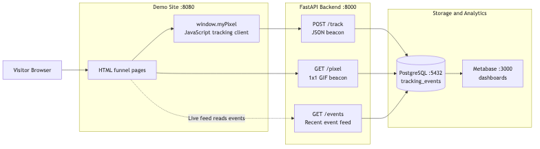

# Pixel Tracking Lab

> A small Dockerized lab for understanding how browser tracking, event collection, and analytics dashboards work end to end.

---

## Why This Exists

Most analytics tools hide the interesting parts. You add a script tag, open a dashboard, and the system feels like magic.

This project makes those parts visible.

You run a demo website, click through a small e-commerce funnel, send real tracking events, store them in Postgres, and inspect them in Metabase. It is meant to be cloned, run, broken, queried, and extended.

Built for developers, data engineers, growth engineers, and anyone curious about what happens after a user clicks a button.

---

## Architecture

<p align="center">
  
</p>


### Services

| Service       | URL                        | What It Does                             |
|---------------|----------------------------|------------------------------------------|
| Demo Site     | http://localhost:8080      | HTML pages that fire tracking events     |
| FastAPI API   | http://localhost:8000/docs | Receives, validates, stores events       |
| PostgreSQL    | port 5432                  | Stores all tracking data                 |
| Metabase      | http://localhost:3000      | Analytics & dashboard UI                 |

---

## Stack

| Layer       | Technology                                |
|-------------|-------------------------------------------|
| Backend     | Python 3.12, FastAPI, SQLAlchemy 2, Uvicorn |
| Database    | PostgreSQL 16                             |
| Frontend    | Vanilla HTML, CSS, JavaScript             |
| Analytics   | Metabase                                  |
| Infra       | Docker Compose                            |

---

## What Is Inside

### Demo Site (`demo-site/`)
Small HTML pages that simulate a simple funnel:

- `index.html` — Home page
- `product.html` — Product detail page
- `signup.html` — User registration page
- `checkout.html` — Checkout & purchase page
- `events.html` — Live feed of recent tracking events
- `reports.html` — Links to Metabase dashboards

### JavaScript Tracking Library (`demo-site/js/pixel.js`)
`window.myPixel` is a lightweight tracking client. It:

- Fires `page_view` automatically on every page load
- Sends custom events with `window.myPixel.track(eventName, payload)`
- Stores `anonymous_user_id` and `session_id` in `localStorage`
- Captures UTM parameters from the URL
- Adds browser metadata like referrer, language, screen size, and user agent
- Supports both JSON POST and image pixel GET tracking

### FastAPI Backend (`backend/`)
The backend receives and stores events:

- `GET /health` — liveness check
- `POST /track` — JSON event tracking
- `GET /pixel` — image pixel tracking, returns a transparent 1x1 GIF
- `GET /events?limit=100` — recent events for the live feed

### PostgreSQL Schema (`sql/init.sql`)
Events are stored in one table: `tracking_events`.

It includes:

- `event_id` (UUID, primary key)
- `event_name`, `event_time`, `page_url`, `referrer`
- `session_id`, `anonymous_user_id`
- `user_agent`, `screen_width`, `screen_height`
- `ip_address`
- `utm_source`, `utm_medium`, `utm_campaign`, `utm_term`, `utm_content`
- `payload_json` (JSONB — free-form data per event)
- `source_type` (`js_pixel` or `image_pixel`)

---

## Quick Start

### Prerequisites
- [Docker Desktop](https://www.docker.com/products/docker-desktop/) running on your machine

### Run

```bash
git clone <repo-url>
cd pixel-tracking-lab
cp .env.example .env
docker compose up --build
```

Wait about 30 seconds, then open:

| What               | URL                               |
|--------------------|-----------------------------------|
| Demo Site          | http://localhost:8080             |
| Live Events Feed   | http://localhost:8080/events.html |
| API Swagger Docs   | http://localhost:8000/docs        |
| Metabase Dashboard | http://localhost:3000             |

### Stop

```bash
docker compose down
```

### Reset (wipe data)

```bash
docker compose down -v
```

---

## Try It

### Basic Event Flow

1. Open http://localhost:8080
2. Navigate: Home → Product → Signup → Checkout
3. Click the action buttons on each page
4. Open http://localhost:8080/events.html

You should see automatic `page_view` events and custom button-click events.

---

### UTM Attribution

Open the site with UTM parameters:

```
http://localhost:8080?utm_source=newsletter&utm_medium=email&utm_campaign=spring_launch
```

Fire a few events, then check:

```bash
curl "http://localhost:8000/events?limit=5"
```

The events should include `utm_source`, `utm_medium`, and `utm_campaign`.

---

### Image Pixel Tracking

Click the button that uses the image pixel transport on the Home page.

You should see an event with `source_type = image_pixel`.

---

### API And Database Inspection

```bash
# Health check
curl http://localhost:8000/health

# Recent events via API
curl "http://localhost:8000/events?limit=20"

# Direct database query
docker compose exec postgres psql -U pixel -d pixel_lab \
  -c "SELECT event_name, source_type, event_time FROM tracking_events ORDER BY id DESC LIMIT 20;"
```

---

### Metabase Dashboards

1. Open http://localhost:3000
2. Connect to PostgreSQL with:
   - Host: `postgres`
   - Port: `5432`
   - Database: `pixel_lab`
   - User: `pixel`
   - Password: `pixel`
3. Browse the `tracking_events` table
4. Build charts: event counts by name, funnel by page, events by UTM campaign

---

## Pixel Tracking In Plain English

There are two common ways to send tracking events.

### JavaScript Beacon
```javascript
window.myPixel.track("add_to_cart", { product_id: "SKU-42", price: 49.99 });
// → POST /track with JSON body
// → Stored as source_type = js_pixel
```

### Image Pixel Beacon
```html

// → GET /pixel → returns transparent 1×1 GIF
// → Stored as source_type = image_pixel
```

The image pixel trick is old, but still useful to understand. Because it is just an image request, it can work in places where JavaScript does not, such as many email clients.

---

## Release Process

Use this when you want to publish a new version of the lab.

1. Make your changes.
2. Run the stack locally:

```bash
docker compose up --build
```

3. Check the main flow:

- Open http://localhost:8080
- Click through the demo pages
- Confirm events show up at http://localhost:8080/events.html
- Confirm Metabase opens at http://localhost:3000

4. Make sure local secrets are not staged:

```bash
git status --short --ignored
```

`.env`, `.env.local`, `.DS_Store`, and cache files should stay ignored.

5. Commit and push:

```bash
git add .
git commit -m "Describe the change"
git push origin main
```

6. Optional: create a Git tag for a named release:

```bash
git tag v0.1.0
git push origin v0.1.0
```

---

## Project Structure

```
pixel-tracking-lab/
├── docker-compose.yml
├── .env.example
├── README.md
│
├── backend/
│   ├── Dockerfile
│   ├── requirements.txt
│   └── app/
│       ├── main.py          ← FastAPI app, CORS, startup
│       ├── config.py        ← Settings via pydantic-settings
│       ├── db.py            ← Engine, session, retry logic
│       ├── models.py        ← TrackingEvent ORM model
│       ├── schemas.py       ← Pydantic request/response schemas
│       ├── routes/
│       │   ├── health.py
│       │   ├── track.py     ← POST /track
│       │   ├── pixel.py     ← GET /pixel
│       │   └── events.py    ← GET /events
│       ├── services/
│       │   └── event_service.py
│       └── utils/
│           └── transparent_pixel.py
│
├── demo-site/
│   ├── Dockerfile
│   ├── nginx.conf
│   ├── index.html
│   ├── product.html
│   ├── signup.html
│   ├── checkout.html
│   ├── events.html
│   ├── reports.html
│   ├── js/
│   │   ├── pixel.js         ← window.myPixel tracking library
│   │   └── app.js           ← Page-specific event bindings
│   └── css/
│       └── styles.css
│
└── sql/
    └── init.sql             ← Schema + indexes
```

---

## Author

Built to make analytics infrastructure easier to see and reason about.
